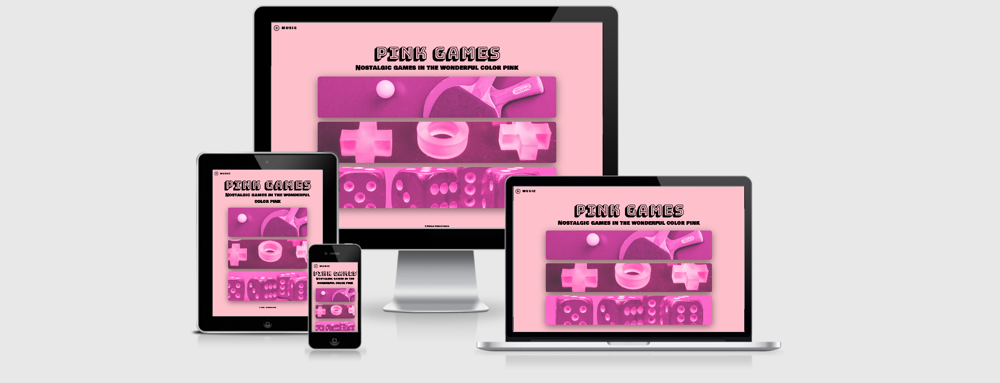

# PINK GAMES

## Code Institute - Interactive Frontend Development Milestone Project

Welcome to the Pink Games website! 

A HTML5, CSS3 & JavaScript website.

A live website can be found [here](https://emiberndt.github.io/Ineractive-Frontend-Project---PinkGames/)

# Table of Contents
- [The Strategy](#the-strategy)
- [The Structure](#the-structure)
- [The Skeleton](#the-skeleton)
- [The Surface](#the-surface)
- [Features](#features)
- [Technologies](#technologies)
- [Testing](#testing)
- [Deployment](#deployment)
- [Credits](#credits)

# The Strategy

### Project goal: Create a website where the user can choose and play easy games in the color pink.

#### User goals:
- Users will get a positive and retro impression from the landing page.
- Users can easily navigate throughout the website to find the information needed.
- User will be encouraged to choose and play the different games.
- Users should find the website easy to navigate, both on the landing page, and at the game pages. They should also be able to have the choice to play some background music while they look at the game menu.  
- The site should be clean in design and straightforward, and aim to focus on just the games.

#### User Expectations:
The site should provide the user with three easily played games. The site should also be easy to navigate through, 
and should be responsive on both desktop, tablet and mobile.

### User Stories:

For the site user
- I want to get a 'feel god vibe' from the landing page.
- I want to find the games easily.
- I want to be able to understand what kind of games that I'm choosing from.
- I want the website to provide easy access to the different sections of the website. 
- I want to be able to navigate through the site quick and easy.

# The Structure

- The elements should all be consistent, in terms of effects, colors and buttons. 
- The site shold be responsive.

# The Skeleton

The wireframes are created with [Balsamiq](https://balsamiq.com/).

Links to view the wireframes:

- [Wireframes](https://github.com/emiberndt/Interactive-Frontend-Project---PinkGames/blob/master/wireframes.pdf)

You will see only small differences to the finished website. As I went on to developed the site there were certain lay-out aspects I thought I could improve from the original idea.
Like the position of the background music, and the lay-out of the games on the desktop landing page. The changes were made purely beacuse the changes looked better when creating the site.

# The Surface 

### Colors 

#### Basic colors:
- Pink
- Black

#### Pink:
- #FF00AB
- #FF8BD9

### Typography
- Bowlby One SC, cursive (overall text)
- 'Bungee Shade, cursive (h1)

### Icons

- fa fa-times
- fa fa-circle-o

# Features

#### All sections:

- Button - To always find your way back to the landing page, where the user will select whick games to play. 
- Colors - There same colors was used throughout the site

#### Landing page:
- Images - I used images, which was edited in Photoshop to give them all the same look.
- Music - I used audio, which was intended to give a 'happy' feel to the site, and make the site sound the way it looks.
The user has the choice not to use this feature.
- Tilt - Gave the game selection cards a tilt.js effect, which comes to life when you hover over.

#### Pink Pong Game 
- Game written in JavaScript
- It allows the user to move a 'paddle' to hit a ball to a computer player, which will then hit the ball back to the user.

#### Pink Tac Toe Game
- Game written in JavaScript 
- It allows the player to play the game 'tic tac toe', and choosing which symbol it would like to play with.
- The user has the choice to replay after result.

#### Pink Dice Game
- Game written in JavaScript 
- It allowes the user to play dice against a computer player.
- The user has the choice to replay after result.

# Technologies

- [HTML](https://developer.mozilla.org/en-US/docs/Web/HTML)
  - used to structure the website and create the elements for the website. 
- [CSS](https://www.w3schools.com/css/) 
  - used to style the markup and create custom styling. 
- [JavaScript](https://www.w3schools.com/js/) 
  - used to style the markup and create custom styling. 
- [Google Developer tools](https://developers.google.com/web/tools/chrome-devtools/) 
  - to help solve a bug and help style my elements before writing code. 
- [Google Fonts](https://fonts.google.com/) 
  - used to import the font style and help create a unique brand. 
- [GitPod](https://www.gitpod.io/) 
  - used as the development environment to help write my code. 
- [GitHub](https://github.com/) 
  - used to store the source code and repository. 
- [GitHub Pages](https://pages.github.com/) 
  - used to deploy my website.
- [Balsamiq](https://balsamiq.com/) 
  - used to help create my wireframes. 

# Testing

#### Google Developer Tools 

I used Google Developer tools to help identify any errors, aswell as testing its responsive features. 

No issues were found and the responsiveness works nicely.

#### Responsive Tools

I have tested my site on Safari, and Google Chrome and the site looks like it was intended to do. 

[Am I Responsive](http://ami.responsivedesign.is/) 

Tested on desktop, notebook, tablet, and mobile.

This is where I created the mockup for the site.

#### Validator Tools

To help validate the HTML, CSS & JavaScript code.

HTML:
[W3C Validator](https://validator.w3.org/)

index.html:

No errors occur when I run the code in this validator.

pinkpong.html, pinktactoe.html, pinkdice.html:

1 error occur. 
- Error: The element a must not appear as a descendant of the button element.

I made the code like this to link the button to the landing page. It works and it doesn't interfer with anything else, so I did not see this as a problem. 

CSS: [W3C CSS Validator](https://jigsaw.w3.org/css-validator/)

style.css, pinkpong.css, pinkdice.css:

No errors occur when I run the code in this validator.

pinktactoe.css:

9 errors occur (3 of the same errors at three places):
- Error: scale is not a transform value : translate (-50%, -50%) scale
- Error: Parse Error (0.9);
- Error: Parse Error }

These css elements are part of the how the game transitions between start - game - result, so I did not see this as a problem.

JavaScript: [JSHint](https://jshint.com/)

script.js, tilt.js:

No errors occur when I run the code in JSHint.

pinkpong.js:

The first time I tride to make the code for this I just couldn't get it to work. I couldn't get the scoreboard to function properly. So I decided to start from scratch again.
After that,

1  error occured. 

I was having a bit of a problem with the game. It was running but not really hitting the ball in the correct way.

I had by mistake forgot to put an l in collide in the code.

After fixing the bug I got the game to run as it should.

I also missed to put semicolon in two places - easily fixed.

pinktactoe.js, pinkdice.js:

Missed to put semicolon in two places - easily fixed.

# Deployment

GitHub Pages:

1. Create a repository on GitHub and a project name/description. 
2. Once this is done, there is an option to open this on GitPod by clicking on the green button. 
3. Initialise your repo by using the git init command
4. Add files to Git (staging area) and use the git add . command
5. Use the git push command to push this 
6. It will now ask for your GitHub credentials (enter this in the terminal). 
7. Go to GitHub and load your repo
8. Click on Settings 
9. Scroll down to GitHub Pages
10. Click on master branch. 
11. Website is live! 

# Credits

#### Sources
- Fonts: [Google Font](https://fonts.google.com/)
- Icon: [Font Awesome](https://fontawesome.com/)
- General questions: [StackOverflow](https://stackoverflow.com/)
- Youtube- JavaScript for beginners: [Video](https://www.youtube.com/watch?v=PkZNo7MFNFg) 
- Tilt.js: [Code](https://gijsroge.github.io/tilt.js/)
- Code Institute Modules - HTML Fundamentals, CSS Fundamentals, User Centric Frontend Development, JavaScript Fundamentals & Interactive Frontend Development

Pink Pong Game:
- [Youtube tutorial](https://www.youtube.com/watch?v=nl0KXCa5pJk)

Channel: Code Explained

(Really good tutorial!)

Pink Tac Toe Game:
- [Youtube tutorial](https://www.youtube.com/watch?v=sNO5awLw9h0)

Channel: CodingNepal

Pink Dice Game:
- [Youtube tutorial](https://www.youtube.com/watch?v=Zvb5VARXLkU)

Channel: CodingWithSanni

#### Media Sources

Images:
- Pink Pong Game

  By Anna Shvets - https://www.pexels.com/photo/table-tennis-rackets-3846048/

- Pink Tac Toe Game

  By Ogutier - https://pixabay.com/photos/connection-teamwork-piece-puzzle-3234929/

- Pink Dice Game

  By blickpixel - https://pixabay.com/photos/cube-game-cube-instantaneous-speed-568192/

  From https://www.pngtree.com:
  
    https://pngtree.com/freepng/vector-dice-one-icon_4102530.html

    https://pngtree.com/freepng/vector-dice-two-icon_4102531.html

    https://pngtree.com/freepng/vector-dice-three-icon_4102532.html

    https://pngtree.com/freepng/vector-dice-four-icon_4102533.html

    https://pngtree.com/freepng/vector-dice-five-icon_4102534.html

    https://pngtree.com/freepng/vector-dice-six-icon_4102535.html

Music:

Composer: Benjamin Tissot (also known as Bensound)

Song: Dreams

https://www.bensound.com/royalty-free-music/electronica

---

Also thanks to:

My mentor: Arnold Kyeza